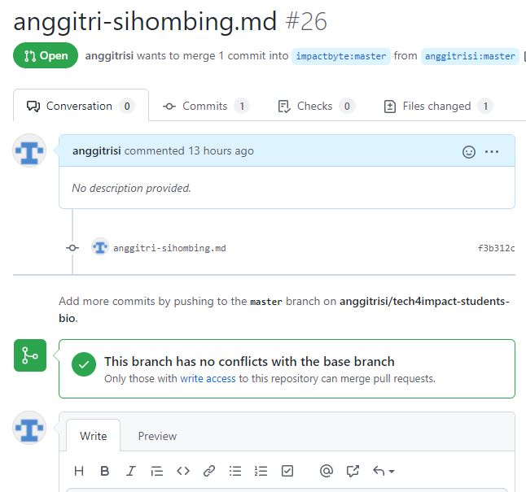

1. Fork repository GitHub https://github.com/impactbyte/tech4impact-students-bio.git menggunakan akun Github kamu

2. Clone remote repository dari hasil fork tersebut. Jangan clone dari repository originalnya.

    `git clone https://github.com/anggitri-sihombing/tech4impact-students-bio.git`
3. Buatlah branch baru dengan nama lengkap kamu. Misalnya david-winalda. Jangan melakukan perubahan pada branch master.

    `git branch anggitri-sihombing`

4. Checkout ke dalam branch tersebut yang telah kamu buat

    `git checkout anggitri-sihombing`

5. Buatlah 1 file format .md dengan nama lengkap kamu. Contoh davidwinalda.md

    `touch anggitri-sihombing.md`

6. Isi file tersebut davidwinalda.md dengan konten di bawah ini:
    ```
    Nama Lengkap: David Winalda
    Umur: 27
    Pesan yang ingin disampaikan: Semangat untuk kamu yang disana sedang berjuang
    ```

    `nano anggitri-sihombing.md`
7. Masukkan file .md tersebut ke dalam staging 

    `git add .`
8. Commit dengan memberikan pesan nama file .md kamu

    `git commit -m "anggitri-sihombing.md"`
9. Merge branch yang telah kamu buat ke dalam branch 

    `git checkout master`
    `git merge anggitri-sihombing`
10. Push ke dalam branch master

    `git push origin master`

11. Lakukan pull request dari GitHub Repository yang telah kamu fork untuk digabungkan ke dalam branch master pada GitHub Repository aslinya.
