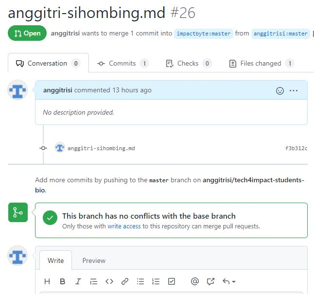

# Tugas 04-GIt-and-Github

## 01-the-basic
Link Repository: https://github.com/anggitrisi/git-basic

`README.md` untuk perintah-perintah: https://github.com/anggitrisi/skilvul-full-stack/tree/main/04-Git-and-Github/01-git-basic 

## 02-portfolio-and-cv
Link Repository: https://github.com/anggitrisi/anggitri-sihombing
README.md untuk perintah-perint

`README.md` untuk perintah-perintah: https://github.com/anggitrisi/skilvul-full-stack/tree/main/04-Git-and-Github/02-portfolio-and-cv

### Git Log

## 03-branch-and-merge
Link Repository: https://github.com/anggitrisi/skilvul-full-stack/tree/main/04-Git-and-Github/03-branch-and-merge

## 04-more-advanced
Link Repository: https://github.com/anggitrisi/skilvul-full-stack/tree/main/04-Git-and-Github/04-more-advanced

## 05-submit-my-changes
Link Pull Request: https://github.com/impactbyte/tech4impact-students-bio/pull/26

###Image: Screenshot of my Pull Request
